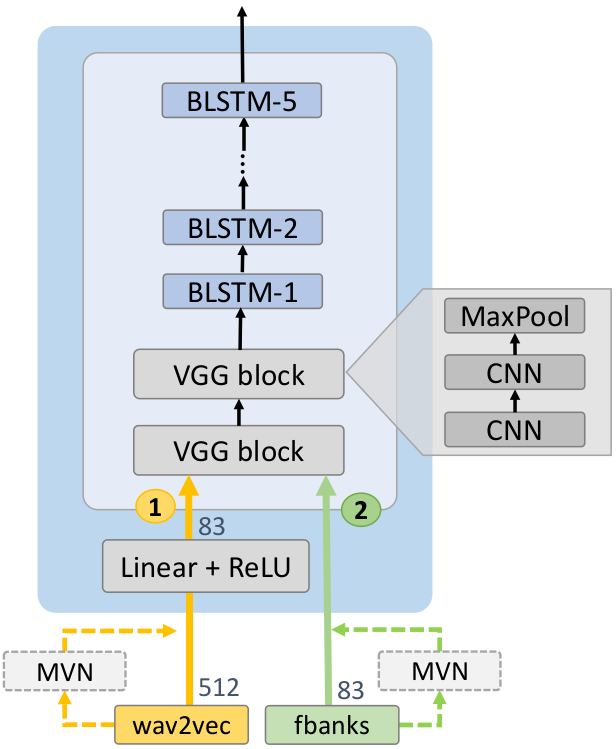

# Recipe for MuST-C en-fr 56 hours

run.sh is a complete recipe for:

#### 1. Extracting features
##### Extracting raw features
This recipe is designed to extract either **_filter-bank_** or **_wav2vec_** features. This can be done by switching between `feature_type=wav2vec` and `feature_type=fbank`.

**Note**: In order to extract **_wav2vec_** features, installing [_fairseq_](https://github.com/pytorch/fairseq/tree/master/examples/wav2vec) beforehand is mandatory.

##### Normalization 
_Cepstral mean and variance normalization (cmvn)_ is optionally applied to the raw features. Setting `cmvn=true` will enable the _cmvn_ mode, otherwise, the raw features will be kept.

#### 2. Training model
As described in our paper, **_wav2vec_** speech encoder can be slightly different from the  **_filter-bank_** (a.k.a the default) one.

In order to select **_wav2vec_** speech encoder, set `wav2vec=true`.

Moreover, if the one's computational capacity is scarce, he/she would need to reduce the size of **_wav2vec_** features. The script makes this possible by setting `idim_reduction=true`. For the purposes mentioned in the paper, **_wav2vec_** features' size will be reduced from 512 to 83 (the size of **_filter-bank_** features).



#### 3. Decoding and scoring
In addition to the ESPnet's default decoding mode (a.k.a decoding a single model), we implemented an ensembling mode.

In order to ensemble models at decoding time, the decoding script (stage 5th in run.sh) can be modify as following:

```shell script
nj=8
set=mustc-tst-COMMON.fr
case=tc
dict=/path/to/dictionary
decode_config=conf/decode.yaml
decode_dir=exp/decode_${set}_emsemble
backend=pytorch

model="/path/to/model1/model.acc.best /path/to/model2/model.acc.best" #input a list of models

## split data files into smaller pieces
# note that the data file can be different from each other in case one ensembles 
# different models using different feature types, for example wav2vec and filter-bank
splitjson.py /path/to/data/of/model1/data.tc.json
splitjson.py /path/to/data/of/model2/data.tc.json

#### use CPU for decoding
ngpu=0

${decode_cmd} JOB=1:${nj} ${decode_dir}/log/decode.JOB.log \
    st_trans.py \
    --config ${decode_config} \
    --ngpu ${ngpu} \
    --backend ${backend} \
    --batchsize 0 \
    --ensemble \
    --api v2 \
    --trans-json /path/to/data/of/model1/split${nj}utt/data.JOB.json \
                 /path/to/data/of/model2/split${nj}utt/data.JOB.json \
    --result-label ${decode_dir}/data.JOB.json \
    --model $model

score_bleu.sh --case ${case} ${decode_dir} de ${dict}
```
