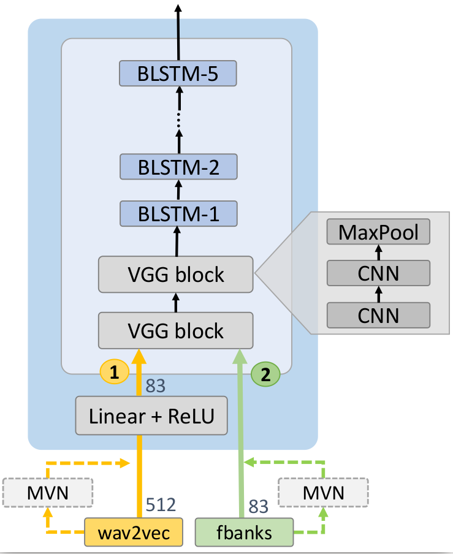

# Recipe for MuST-C en-fr 56 hours

run.sh is a complete recipe for:

#### 1. Extracting features
##### Extracting raw features
This recipe is design to extract either **_filter-bank_** or **_wav2vec_** features. This can be done by switching between `feature_type=wav2vec` and `feature_type=fbank`.

**Note**: In order to extract **_wav2vec_** features, installing [_fairseq_](https://github.com/pytorch/fairseq/tree/master/examples/wav2vec) beforehand is mandatory.

##### Normalization 
_Cepstral mean and variance normalization (cmvn)_ is optionally applied to the raw features. Setting `cmvn=true` will enable the _cmvn_ mode, otherwise, the raw features will be kept.

#### 2. Training model
As described in our paper, **_wav2vec_** speech encoder can be slightly different from the  **_filter-bank_** (a.k.a the default) one.

In order to select **_wav2vec_** speech encoder, set `wav2vec=true`.

Moreover, if the one's computational capacity is scarce, he/she would need to reduce the size of **_wav2vec_** features. The script makes this possible by setting `idim_reduction=true`. For the purposes mentioned in the paper, **_wav2vec_** features' size will be reduced from 512 to 83 (the size of **_filter-bank_** features).

#### 3. Decoding and scoring
